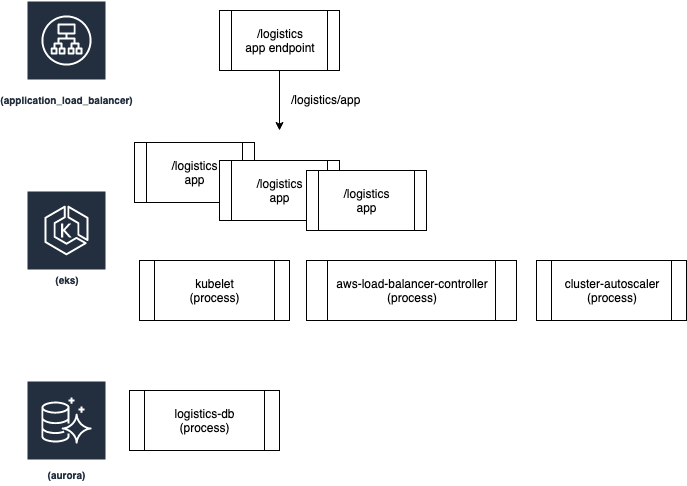
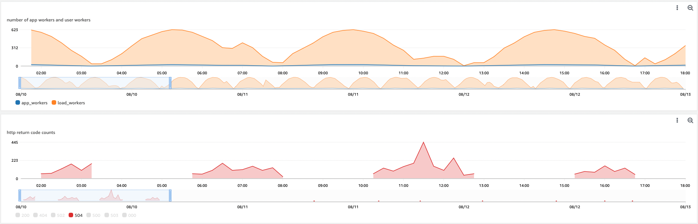
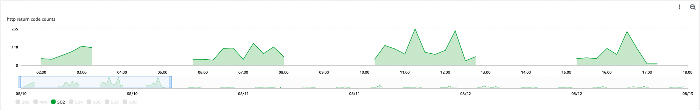
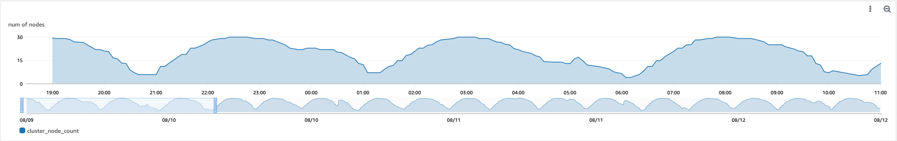
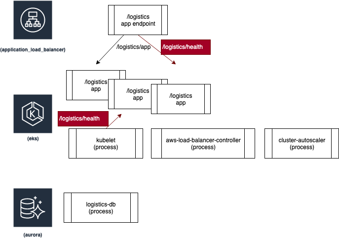
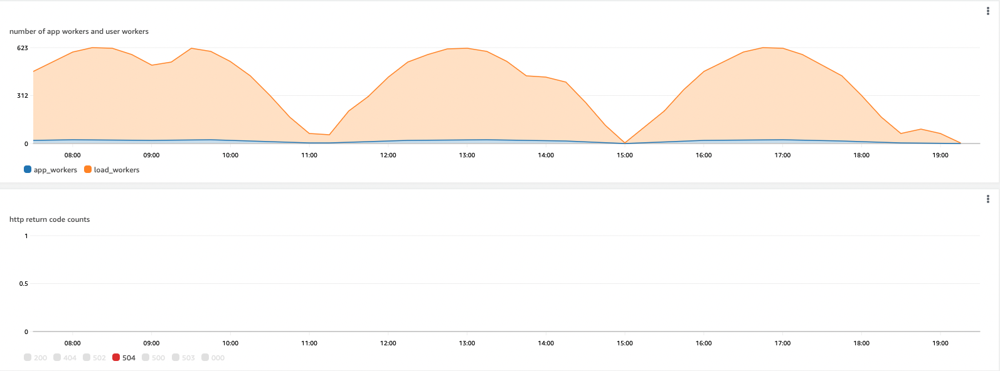
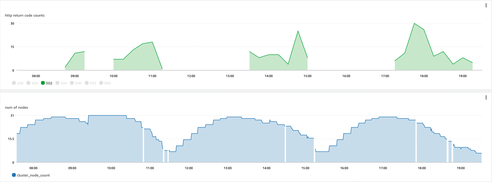

# How to rapidly scale your application with ALB on EKS (without losing traffic)

For scalable HTTP-based applications, your application servers Kuberenetes pods need to expand and shrink their processing capacity regularly in order to meet user demand efficiently. AWS Application Load Balancer automatically distributes your incoming traffic. 

When redundant capacity is removed due to reduced demand, the application might briefly interrupt users and, on a large scale, these interruptions might be painful. Therefore, we would like to build a robust architecture that allows the application resource to scale down gracefully and minimise user impact. Achieving graceful shutdown requires joint configuration in the application, Kubernetes, and the ALB's target groups. AWS Load Balancer controller supports [Pod readiness gates](https://kubernetes-sigs.github.io/aws-load-balancer-controller/v2.4/deploy/pod_readiness_gate/) to indicate that pod is registered to the ALB/NLB and healthy to receive traffic. The controller automatically injects the necessary readiness gate configuration to the pod spec via mutating webhook during pod creation.

We implement application health indications that are not part of an application functionality that interacts with the end-users and then we use it for the load-balancer target health and pod readiness probes. We provide a large scale load simulation of 1000 concurrent sessions at pick deployed in 600 pods and 30 nodes. We demonstrate that applying these steps reduces the 50X HTTP error rates from 37% at a large scale down event to only 1%. 

## Simulation architcture
We built a fictitious application to demonstrate the required steps to enable the application to gracefully terminate with minimal impact to users. The application is an ordering system that allows users to place an order and update it. Orders are stored in a database allowing the application to be stateless behind an application load balancer (ALB). We use the AWS-load-balancer controller to simplify the ALB configuration with the Kubernetes-based targets.  



## Simulation setup
This sample deploys a web application behind ALB and demonstrates seamless failover between pods during scale down event triggered by cluster autoscaler or karpenter. We first install EKS cluster, enable Amazon CNI to use IP-based ALB target, install aws-load-balancer controller add-on, then we use a simple Django app that accepts synthetic requests from a load simulator that changes the application replica-set size. Additionally, we deploy cluster autoscaler which changes the autoscale-group size to suit the needs of Django app pods. We monitor the application's health during scale-down events.


```bash
export AWS_ACCOUNT_ID=$(aws sts get-caller-identity --output text --query Account)
export AWS_REGION=us-west-2
export INSTANCE_FAMILY=m5
export INSTANCE_ARCH=arm
```

* Deploy EKS cluster and [cluster autoscaler](./cluster-autoscaler-autodiscover.yaml) or [karpenter](https://karpenter.sh/v0.20.0/getting-started/getting-started-with-eksctl/)

```bash
eksctl create cluster -f eks-cluster-spec.yaml
```
** Follow the [karpenter install steps](https://karpenter.sh/v0.20.0/getting-started/getting-started-with-eksctl/)

Deploy [karpenter-provisioner.yaml](./karpenter-provisioner.yaml) 

```bash
cat ./karpenter-provisioner.yaml | envsubst | kubectl apply -f -
```

** When using [cluster autoscaler](./cluster-autoscaler-autodiscover.yaml), update the cluster name under `node-group-auto-discovery`

* Deploy [aws-loadbalancer-controllers](https://docs.aws.amazon.com/eks/latest/userguide/aws-load-balancer-controller.html)

* Setup [Container Insights on the cluster](https://docs.aws.amazon.com/AmazonCloudWatch/latest/monitoring/Container-Insights-setup-EKS-quickstart.html)

* Deploy [database](https://github.com/aws-samples/amazon-aurora-call-to-amazon-sagemaker-sample/tree/master/multiplayer-matchmaker/aurora-pg-cdk)

* Deploy ECR repo and SQS queue for the django and the load simulator


```bash
./create-ecr-sqs.sh
cat ./create-iamserviceaccount-appsimulator.sh | envsubst | bash
```

* build the web app docker image

```bash
cd logistics_app
cat ./build.sh | envsubst | bash 
```

* build the load simulator image

```bash
cd load_simu_app
cat ./build.sh | envsubst | bash
```

* deploy app and load simulator

```bash
cat django-svc-ingress-deploy-before.yaml | envsubst | kubectl apply -f - 
cat appsimulator.yaml | envsubst | kubectl apply -f -
```

* discover the application `EXTERNAL-IP` and configure the `app-loader` 

```bash
kubectl  get svc| grep django-svc
```

popultae the `APP_URL` in with `EXTERNAL-IP` value and deploy the application loader. For example:

```
$kubectl  get svc 
NAME         TYPE        CLUSTER-IP      EXTERNAL-IP   PORT(S)        AGE
django-svc   NodePort    10.100.116.33   django-app-1443363332.us-west-2.elb.amazonaws.com        80:31101/TCP   3h24m
kubernetes   ClusterIP   10.100.0.1      <none>        443/TCP        6h27m
```

```bash
export APP_URL="django-app-1443363332.us-west-2.elb.amazonaws.com"
cat app-loader.yaml | envsubst | kubectl apply -f -
```
let it run for 30 min and then apply the changes that consider the app health without impacting the user


```bash
cat django-svc-ingress-deploy-after.yaml | envsubst | kubectl apply -f -
```

## Evaluation

After running the load for few load cycles, create a cloud watch dashboard of the metrics published by the simulator under the appsimulator namespace and the `number_node_count` in Container Insights.





Note the growing 50x HTTP error rate during scale down event caused by shrinking demand, number of app and user workers. At pick, the number of user simulation workers is 623 pods deployed on 30 t4g.xlarge EC2 instance nodes. 

### The steps we did to remove the errors:

We implemented a new [application health functionality](logistics_app/logisitcs/health.py) and a [signal handler](https://docs.python.org/3/library/signal.html). Then we configured the load balancer target group and kubelet to use the new health indication. 



* Add to our fictitious `/logisitics` application an health [URI](./logistics_app/logistics/health.py) that is not serving live users, `/logisitics/health` in our case. 

* Configure Kubernetes [readinessProbe](https://kubernetes.io/docs/tasks/configure-pod-container/configure-liveness-readiness-startup-probes/) to  `/logisitics/health` URI with a frequency that is less or equal than [alb.ingress.kubernetes.io/healthcheck-interval-seconds](https://kubernetes-sigs.github.io/aws-load-balancer-controller/v2.2/guide/ingress/annotations/) so the kubelet will mark the container as not available roughly at the same time.

From [Kuberentes Ingress spec](./django-svc-ingress-deploy-after.yaml)
```yaml
kind: Ingress
metadata:
  name: django-ingress
  annotations:
    kubernetes.io/ingress.class: alb
    alb.ingress.kubernetes.io/healthcheck-path: /logistics/health
    alb.ingress.kubernetes.io/success-codes: '200-301'
    alb.ingress.kubernetes.io/healthcheck-interval-seconds: '3'
```

From [application Kubernetes spec](./django-svc-ingress-deploy-after.yaml)
```yaml
          readinessProbe:
            httpGet:
              path: /logistics/health
              port: 8000
            initialDelaySeconds: 3
            periodSeconds: 3
```

* Configure a [preStop hook](https://kubernetes.io/docs/concepts/containers/container-lifecycle-hooks/) that will cause the container's health to be unhealthy. The kubelet send [SIGTERM](https://kubernetes.io/docs/tasks/administer-cluster/safely-drain-node/) to all running containers after the Kubernetes node marked for termination by [cluster autoscaler](https://github.com/kubernetes/autoscaler) or [karpenter](https://karpenter.sh). Our method is to modify Django health to unhealthy and break the `/logisitics/health` URI while still processing live users' `/logistics` requests.

From [application Kubernetes spec](./django-svc-ingress-deploy-after.yaml)
```yaml
          lifecycle:
            preStop:
              exec:
                command: ["/bin/sh", "-c", "sed -i 's/health/nothealthy/g' /usr/src/app/logistics/health.py && sleep 120"]
```

## The results




We can see that the number of 504 errors dropped from average of 340 during scale down event to 0 and 502 errors from 200 during scale down event to 30. Note that the 502 errors did not effect the users as it was sent by the pod to kubelet and ALB control plane before decommissioning the container.  

## Cleanup

* Delete the EKS cluster
```bash
eksctl delete cluster -f eks-arm64-cluster-spec.yaml
```

* Delete [database](https://github.com/aws-samples/amazon-aurora-call-to-amazon-sagemaker-sample/tree/master/multiplayer-matchmaker/aurora-pg-cdk)

* Delete ECR repo for the django and the load simulator

```bash
./delete-ecr-repos.sh
```

## Conclusion
Scalable applications require seamless expansion and contraction of their capacity without affecting their users. Therefore, it is necessary to allow the hosting platform to terminate application instances gracefully. The EKS and AWS Load Balancer controller make it easy by assessing the app's readiness to serve users with Pod readiness gates. To facilitate graceful termination, application developers must handle the SIGTERM signal and implement application health checks that do not serve users.

## Security

See [CONTRIBUTING](CONTRIBUTING.md#security-issue-notifications) for more information.

## License

This library is licensed under the MIT-0 License. See the LICENSE file.
