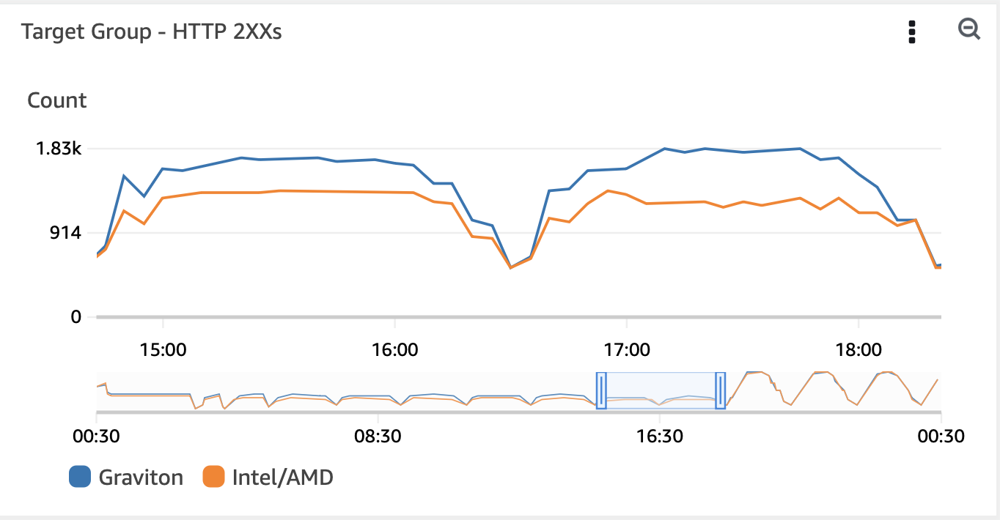
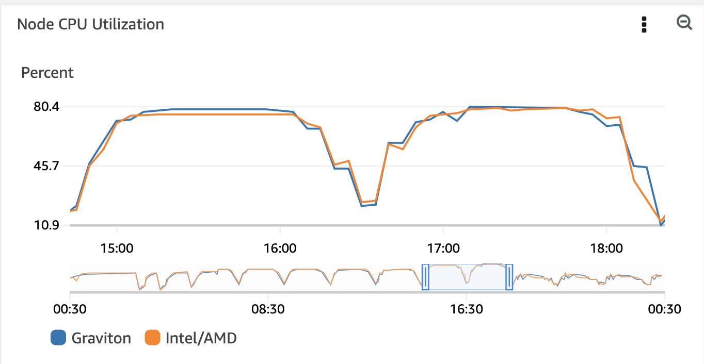

# Simple Web Application to demonstrate deployment of multi-arch images of ARM64 and AMD64

## Methodology 
* Populate the following enviroment variables

```shell
export AWS_ACCOUNT_ID=$(aws sts get-caller-identity --output text --query Account)
export AWS_REGION=us-west-2
export BUILDX_VER=v0.10.3
export APP_IMAGE_NAME=simplemultiarchimage
export APP_IMAGE_TAG=multiarch-py3
export CLUSTER_NAME=grv-usw2
export KARPENTER_VERSION=v0.27.0
export AWS_DEFAULT_REGION=us-west-2
export TEMPOUT=$(mktemp)
```

* Enable multi-arch builds (linux/arm64 and linux/amd64)
```bash
docker buildx create --name craftbuilder
```

* Create and deploy the ECR docker registry and images for the app

```bash
./create-ecr-sqs.sh
./buildx.sh
```

* Deploy Karpenter
Follow https://karpenter.sh for cluster and karpneter install

* Deploy container insights
Follow [container insights deploy steps](https://docs.aws.amazon.com/AmazonCloudWatch/latest/monitoring/Container-Insights-setup-EKS-quickstart.html)
```bash
ClusterName=${CLUSTER_NAME}
RegionName=${AWS_REGION}
FluentBitHttpPort='2020'
FluentBitReadFromHead='Off'
[[ ${FluentBitReadFromHead} = 'On' ]] && FluentBitReadFromTail='Off'|| FluentBitReadFromTail='On'
[[ -z ${FluentBitHttpPort} ]] && FluentBitHttpServer='Off' || FluentBitHttpServer='On'
curl https://raw.githubusercontent.com/aws-samples/amazon-cloudwatch-container-insights/latest/k8s-deployment-manifest-templates/deployment-mode/daemonset/container-insights-monitoring/quickstart/cwagent-fluent-bit-quickstart.yaml | sed 's/{{cluster_name}}/'${ClusterName}'/;s/{{region_name}}/'${RegionName}'/;s/{{http_server_toggle}}/"'${FluentBitHttpServer}'"/;s/{{http_server_port}}/"'${FluentBitHttpPort}'"/;s/{{read_from_head}}/"'${FluentBitReadFromHead}'"/;s/{{read_from_tail}}/"'${FluentBitReadFromTail}'"/' | kubectl apply -f -
```

* Deploy AWS LoadBalancer Controller
Follow [aws-loadbalancer-controllers](https://docs.aws.amazon.com/eks/latest/userguide/aws-load-balancer-controller.html)
```bash
eksctl create iamserviceaccount \
  --cluster=${CLUSTER_NAME} \
  --namespace=kube-system \
  --name=aws-load-balancer-controller \
  --role-name "AmazonEKSLoadBalancerControllerRole" \
  --attach-policy-arn=arn:aws:iam::${AWS_ACCOUNT_ID}:policy/AWSLoadBalancerControllerIAMPolicy \
  --approve

helm install aws-load-balancer-controller eks/aws-load-balancer-controller \
  -n kube-system \
  --set clusterName=${CLUSTER_NAME} \
  --set serviceAccount.create=false \
  --set serviceAccount.name=aws-load-balancer-controller
```

* Deploy two karpenter provisioners

```bash
cat app-arm-provisioner.yaml | envsubst | kubectl apply -f -
cat app-amd-provisioner.yaml | envsubst | kubectl apply -f -
```

* Create K8s service and ingress for the sample webapp with three paths: `/arm`, `/amd` and `/app`. `/app` will redirect the traffic between `/arm/` and `/amd`

```bash
cat app-svc-ingress.yaml | envsubst | kubectl apply -f -
```

* Deploy the sample app

```shell
cat app-arm-deploy.yaml | envsubst | kubectl apply -f -
cat app-amd-deploy.yaml | envsubst | kubectl apply -f -
```

* Discover the ingress ALB endpoint

```shell
kubectl get ingress
```

Copy the ADDRESS value and browse to http://$ADDRESS/app/runtime/ and notice the `instance-type` alternating between pods that runs on `arm64` and `amd64` cpus.

* Single-Node tests - run a load simulator to test the performance within single Graviton node and single Intel/AMD node. 
Configure the `ARM_APP_URL` and `AMD_APP_URL` with the ALB address (previous step) and deploy the app loader

```shell
kubectl apply -f app-loader.yaml
```

* Let it run for an hour and observe the CW target group metric `HTTPCode_Target_2XX_Count` under `AWS/ApplicationELB` to assess the application throughput among the two target groups. 

* Multi-Node test - add [HPA](https://kubernetes.io/docs/tasks/run-application/horizontal-pod-autoscale/) that will scale the number of pods to see how Graviton throughput scales across many nodes
```
kubectl autoscale deploy armsimplemultiarchapp --cpu-percent=90 --min=1 --max=100
kubectl autoscale deploy amdsimplemultiarchapp --cpu-percent=90 --min=1 --max=100
```

## Results





## Analysis
The single-node test is designed to test the application's throughput under minor and significant loads. There is no difference in throughput under minor load (<40%) but app throughput that runs on Graviton is between 30%-50% higher than app throughput that runs on Intel under heavy load >70%. That's attributed to the minimal overhead of context-switch in Graviton compared to Intel's simultaneous multithreading. 

In the multi-node test, similar app throughput is tested across many nodes, which translates into cost. When the HPA threshold is crossed during >90% load, we see 7 Intel nodes compared to 3 Graviton nodes to achieve the same throughput. 
