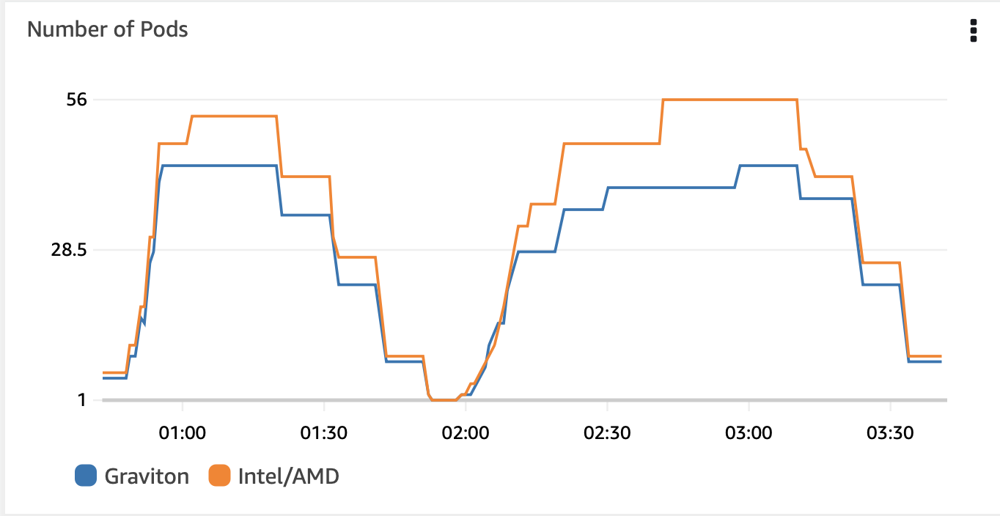

# Simple Web Application to demonstrate deployment of multi-arch images of Graviton3(c7g) and Intel/AMD(c6) instacnes

## Introduction
Graviton instances can reduce compute costs up to 30% with high concurrent workloads. You can also increase your application's resilience by allowing it to run on both Intel/AMD and Graviton EC2 instances. We show you how to transform your CPU-bounded Python application into a processor-agnostic application that performs 30% faster on c7g EC2 instances than c6 EC2 instances.

Firstly, we use Karpneter to launche the right EC2 instance based on application fit and availability in the AWS region after building a Docker image that supports Intel and Graviton instances. Next, we increase CPU usage by loading the application with synthetic requests. Finally, we compare application throughput on Graviton versus Intel/AMD instances throughout the load cycle.

## Methodology 
* Populate the following enviroment variables

```shell
export AWS_ACCOUNT_ID=$(aws sts get-caller-identity --output text --query Account)
export AWS_REGION=us-west-2
export BUILDX_VER=v0.10.3
export APP_IMAGE_NAME=simplemultiarchimage
export APP_IMAGE_TAG=multiarch-py3
export APP_IMAGE_ARM_TAG=multiarch-py3-arm
export APP_IMAGE_AMD_TAG=multiarch-py3-amd
export CLUSTER_NAME=grv-usw2
export KARPENTER_VERSION=v0.27.0
export AWS_DEFAULT_REGION=us-west-2
export TEMPOUT=$(mktemp)
```

* Enable multi-arch builds (linux/arm64 and linux/amd64)
```bash
docker buildx create --name craftbuilder
```

* Create and deploy the ECR docker registry and images for the app

```bash
./create-ecr-sqs.sh
./buildx.sh
```

We used `docker buildx` for simplicity but there are cases where the buildx emulator throws exceptions or too slow. In such cases we reccomend using [native `docker build` follow by `docker manifest`](https://github.com/aws-samples/containerized-game-servers/blob/master/supertuxkart/multi-arch-ci.md)

* Deploy Karpenter
Follow https://karpenter.sh for cluster and karpneter install

* Deploy container insights
Follow [container insights deploy steps](https://docs.aws.amazon.com/AmazonCloudWatch/latest/monitoring/Container-Insights-setup-EKS-quickstart.html)
```bash
ClusterName=${CLUSTER_NAME}
RegionName=${AWS_REGION}
FluentBitHttpPort='2020'
FluentBitReadFromHead='Off'
[[ ${FluentBitReadFromHead} = 'On' ]] && FluentBitReadFromTail='Off'|| FluentBitReadFromTail='On'
[[ -z ${FluentBitHttpPort} ]] && FluentBitHttpServer='Off' || FluentBitHttpServer='On'
curl https://raw.githubusercontent.com/aws-samples/amazon-cloudwatch-container-insights/latest/k8s-deployment-manifest-templates/deployment-mode/daemonset/container-insights-monitoring/quickstart/cwagent-fluent-bit-quickstart.yaml | sed 's/{{cluster_name}}/'${ClusterName}'/;s/{{region_name}}/'${RegionName}'/;s/{{http_server_toggle}}/"'${FluentBitHttpServer}'"/;s/{{http_server_port}}/"'${FluentBitHttpPort}'"/;s/{{read_from_head}}/"'${FluentBitReadFromHead}'"/;s/{{read_from_tail}}/"'${FluentBitReadFromTail}'"/' | kubectl apply -f -
```

* Deploy AWS LoadBalancer Controller
Follow [aws-loadbalancer-controllers](https://docs.aws.amazon.com/eks/latest/userguide/aws-load-balancer-controller.html)
```bash
eksctl create iamserviceaccount \
  --cluster=${CLUSTER_NAME} \
  --namespace=kube-system \
  --name=aws-load-balancer-controller \
  --role-name "AmazonEKSLoadBalancerControllerRole" \
  --attach-policy-arn=arn:aws:iam::${AWS_ACCOUNT_ID}:policy/AWSLoadBalancerControllerIAMPolicy \
  --approve

helm install aws-load-balancer-controller eks/aws-load-balancer-controller \
  -n kube-system \
  --set clusterName=${CLUSTER_NAME} \
  --set serviceAccount.create=false \
  --set serviceAccount.name=aws-load-balancer-controller
```

* Deploy two karpenter provisioners

```bash
cat app-arm-provisioner.yaml | envsubst | kubectl apply -f -
cat app-amd-provisioner.yaml | envsubst | kubectl apply -f -
```

Note we used `instance-generation`, `instance-cpu`, and `arch` labels to Karpenter to launch `c7g.large` and `c6.large` or `c6a.large` instances. 

```shell
  - key: karpenter.k8s.aws/instance-generation
    operator: In
    values:
    - "7"
  - key: karpenter.k8s.aws/instance-cpu
    operator: In
    values:
    - "2"
  - key: kubernetes.io/arch
    operator: In
    values:
    - arm64
```

```shell
  - key: karpenter.k8s.aws/instance-generation
    operator: In
    values:
    - "6"
  - key: karpenter.k8s.aws/instance-cpu
    operator: In
    values:
    - "2"
  - key: kubernetes.io/arch
    operator: In
    values:
    - amd64
```
* Create K8s service and ingress for the sample webapp with three paths: `/arm`, `/amd` and `/app`. `/app` will redirect the traffic between `/arm/` and `/amd`

```bash
cat app-svc-ingress.yaml | envsubst | kubectl apply -f -
```

* Deploy the sample app

```shell
cat app-arm-deploy.yaml | envsubst | kubectl apply -f -
cat app-amd-deploy.yaml | envsubst | kubectl apply -f -
```

We simulated CPU usage by the application with numpy matrix multiplication of two random generated pandas DataFrames using `numpy.matmul`. We used `_matrix_dim,` to control the CPU usage. Larger value casues more CPU usage. The baseline is `MATRIX_DIM=500` will cap the c7g.large and c6a.large to 80% CPU usage.

```python
import numpy as np
import pandas as pd

_matrix_dim=int(os.environ['MATRIX_DIM'])

df1 = pd.DataFrame(data=np.random.randint(_matrix_dim,size=(_matrix_dim,_matrix_dim)));
df2 = pd.DataFrame(data=np.random.randint(_matrix_dim,size=(_matrix_dim,_matrix_dim)));
df12 = np.matmul(df1,df2)
```

* Discover the ingress ALB endpoint

```shell
kubectl get ingress
```

Note we used two k8s services to route traffic to the Graviton and Intel powered pods. Note the `service.selector.app` in both services and the one specified in the `deployment.template.metadata.labels.app`

```
apiVersion: v1
kind: Service
metadata:
  name: armsimplemultiarchapp-svc
spec:
  selector:
    app: armsimplemultiarchapp
  ports:
    - port: 80
      targetPort: 8000
  type: NodePort
---
apiVersion: v1
kind: Service
metadata:
  name: amdsimplemultiarchapp-svc
spec:
  selector:
    app: amdsimplemultiarchapp
  ports:
    - port: 80
      targetPort: 8000
  type: NodePort
---
```

We then use the two service in the ingress definition to route to the appropriate prefix (`/amd` or `/arm`) that AWS Load Balancer Controller creates two target groups. We are going to use the target groups CW to measure the application throughput per processor type. We implemented data [sampling](./app/views.py) to altenrate traffic when users issue general request.  

```python
from django.shortcuts import redirect
import random

def redirect_view(request):
  app_number=random.randint(1,2)
  if app_number==1:
    redirect_to='/arm/runtime'
  if app_number==2:
    redirect_to='/amd/runtime'
  response = redirect(redirect_to)
  return response
```

```shell
spec:
  rules:
    - http:
        paths:
          - path: /app
            pathType: Prefix
            backend:
              service:
                name: amdsimplemultiarchapp-svc
                port:
                  number: 80
          - path: /amd
            pathType: Prefix
            backend:
              service:
                name: amdsimplemultiarchapp-svc
                port:
                  number: 80
          - path: /arm
            pathType: Prefix
            backend:
              service:
                name: armsimplemultiarchapp-svc
                port:
                  number: 80
```

Copy the ADDRESS value and browse to http://$ADDRESS/app/runtime/ and notice the `instance-type` alternating between pods that runs on `arm64` and `amd64` cpus.

* Single-Node tests - run a load simulator to test the performance within single Graviton node and single Intel/AMD node. 
Configure the `ARM_APP_URL` and `AMD_APP_URL` with the ALB address (previous step) and deploy the app loader

```shell
kubectl apply -f app-loader.yaml
```

* Let it run for an hour and observe the CW target group metric `HTTPCode_Target_2XX_Count` under `AWS/ApplicationELB` to assess the application throughput among the two target groups. 

* Multi-Node test - add [HPA](https://kubernetes.io/docs/tasks/run-application/horizontal-pod-autoscale/) that will scale the number of pods to see how Graviton throughput scales across many nodes
```
kubectl autoscale deploy armsimplemultiarchapp --cpu-percent=90 --min=1 --max=100
kubectl autoscale deploy amdsimplemultiarchapp --cpu-percent=90 --min=1 --max=100
```

## Results
### Single-node load test


### Multi-node load test



## Analysis
The single-node test is designed to test the application's throughput under minor and significant loads. There is small difference in throughput under minor load (<70%) but app throughput that runs on Graviton is between 30%-50% higher than app throughput that runs on Intel under heavy load >70%. That's attributed to the minimal overhead of context-switch in Graviton compared to Intel's simultaneous multithreading. 

We consider the load valid until the application fails and returns HTTP 5XX for more than 1% of the load. We noticed that the X86-based app fails when the CPU Utilization crosses 80% and the Graviton crosses 90%. 

In the multi-node test, similar app throughput is tested across 50 nodes, which translates into cost. When the HPA threshold is crossed during >90% load, we see 30% better Graviton utilization, 56 Intel nodes compared to 43 Graviton nodes to achieve the same throughput. 

## Conclusion

Graviton3 performance benefits are shown during heavy load compared to Intel processors because of the 1 vCPU to 1 physical processor core mapping and large cache (L1, L2, and L3). 

Also, docker images that run on both Graviton and Intel processors helps to procure capacity from multiple EC2 Instance pools (Spot and on-demand) 
